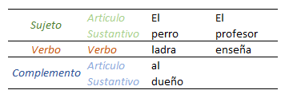
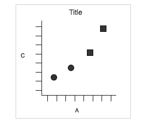

```{r xaringan-themer, include = FALSE}
library(xaringanthemer)
library(DiagrammeR)
library(tidyverse)
library(kableExtra)
options(htmltools.dir.version = FALSE)
style_mono_accent_inverse(
  base_color = "#e1af19",
  link_color = "#b1d5d8",
  header_font_google = google_font("Oswald", "500"),
  text_font_google   = google_font("Roboto Slab", "400", "400i"),
  code_font_google   = google_font("IBM Plex Mono")
)
```
```{css, echo=FALSE}
/* custom.css */
.left-code {
  color: #777;
  width: 38%;
  height: 92%;
  float: left;
}
.right-plot {
  width: 60%;
  float: right;
  padding-left: 1%;
}
.plot-callout {
  height: 225px;
  width: 450px;
  bottom: 5%;
  right: 5%;
  position: absolute;
  padding: 0px;
  z-index: 100;
}
.plot-callout img {
  width: 100%;
  border: 4px solid #23373B;
}
```
# Webinar

- `r icon::fa("r-project")` y RStudio  
     
--

- La **gramática de gráficos** y ggplot2        
      

--

- **Ploteo** con ggplot2:

  * Data
  * Map
  * Geoms
  * Scales
  * Themes
     
---
# ¿Por qué `r icon::fa("r-project")`?


---

# `r icon::fa("r-project")` como lenguaje orientado a objetos

`r icon::fa("r-project")` is an **object-oriented** statistical programming language: all objects can be stored

```{r object oriented}
a <- c(5, 6)
b <- 2
a*b
```

---
# Funciones en `r icon::fa("r-project")`

- Las **funciones** son las herramientas que sirven para trabajar con los datos, también son objetos almacenables y modificales

- Las **funciones** precisan de argumentos:

```{r, echo=TRUE}
a <- c(3, 5, 9)
mean(x = a)
mean(a)
```

---
# `r emo::ji("sos")` Help!

#### `help()`

 - Ayuda con las funciones:  

```{r documentation, echo=T, eval=FALSE}
help(mean)
?mean
```    

--

- Vignettes y ejemplos     

- [Stackoverflow](https://stackoverflow.com/)    

- [Cheatsheets](https://www.rstudio.com/resources/cheatsheets/)    

- [Quick `r icon::fa("r-project")`](https://www.statmethods.net/)


---
# Working flow en RStudio

- script
  * Comentar
  * ejecutar el código

- datos

- consola

- gráficos

---
# Paquetes, datos y funciones

- Tidyverse y ggplot2

- mpg

- Funciones para explorar los datos:

```{r, eval=FALSE}
str(df) # estructura del data frame (df)
summary(df) # estadísticos descriptivos de las variables del df
head(df) # muestra primeras 6 observaciones del df
```

### `r emo::ji("brain")` Try it 1

---
# `r emo::ji("nerd_face")` En mi barrio te vacilo y en el tuyo marco estilo

- Nombrar objetos
  * 2Cs: Conciso y consistente
  * Minúscula
  * Estilos: `sexoEdad`, `sexo_edad` o `sexo.edad`    

--

- Comentar `#` [`Ctrl` + `Mayús` + `C`]
  * Explicar el por qué
  * Usar separadores para organizar el scrip [`Ctrl` + `Mayús` + `R`]

--

- Espacios  
  * Usar espacios en torno a los operadores
  * Evitar espacios en el principio/final de los paréntesis
  
```{r spaces, eva=FALSE}
a<-22+23 # mal
a <- 22 + 23 # bien
```

---

#Introducción a ggplot2: data, aesthetics y geoms

## La gramática





---

##ggplot2 y la gramática de gráficos

* ggplot2 es un paquete de R utilizado para generar gráficos
* Su estructura está basada en la gramática de gráficos (Wickham, 2010)
* Elementos de la gramática de gráficos en ggplot2:
     * **Data**
     * **Aesthetics**
     * **Geometries**
     * Statistics
     * Facets
     * Coordinates
     * Theme
   
---   
     
##Estructura ggplot2

* **ggplot2** se estructura basado en la gramática de gráficos a través de capas, cada
capa añade un elemento nuevo  
   
* Cada capa se añade utilizando el signo "+"
   
* Estructura básica: 

```{r fig.width=2.25, fig.height=2.25, echo=T, warning=FALSE, eval=FALSE}
myplot <- ggplot(data=mydata, aes(aes1=var1, 
                                  aes2=var2, aesN=varN)) + 
                  geom_xxx() +
                  stat_xxx() +
                  facet_XXX() +
                  theme()
myplot
```
---
   
##Ejemplo ggplot2 I
En la primera capa se establecen data y aestehtics:
```{r fig.width=2.25, fig.height=2.25, echo=T, warning=FALSE}
g1 <- ggplot(data = mtcars, aes(x = wt, y = mpg))
g1
```
---

##Ejemplo ggplot2 II
En la segunda se añade "+" la geom:
```{r fig.width=2.25, fig.height=2.25, echo=T, warning=FALSE}
g1 <- g1 + geom_point()
g1
```
---

##Datos 
 
* Piensa en el gráfico y en la estructura de **datos** que necesitas para llevarlo a cabo   
      
* Primero lleva a cabo las operaciones como recodificaciones, creación de nuevas variables...
        
* La transformación de datos pueden ahorrar mucho tiempo

---

##Ejemplo datos
Queremos realizar un gráfico de la relación entre peso (wt) del coche y aceleración (qsec), pero solo para los automáticos
 
```{r fig.width=2.25, fig.height=2.25, echo=T, warning=FALSE}
head(mtcars[, c("am", "wt", "qsec")], n=10)
```
---

##Ejemplo datos 2
Para seleccionar solo los casos $am == "Automatico"$ hay dos opciones:  

```{r fig.width=2.25, fig.height=2.25, echo=T, warning=FALSE, eval=FALSE}
#Opción 1

mtcars2 <- filter(mtcars, am == "Automatico")

myplot <- ggplot(data = mtcars2, aes(x= wt, y=qsec)) + 
                geom_point()
#Opción 2

myplot <- ggplot(data = filter(mtcars2, am == "Automatico"),
                 aes(x= wt, y=qsec)) + 
                geom_point()


```
---

##Aesthetics I

La **aesthetics** se refiere a las características del gráfico que utilizamos para representar (*mapear*) información.
   
Aspectos que pueden ser utilizados para representar información (cambia según la geometría): 
   
* Eje x (x)
* Eje y (y)
* Color (col)
* Forma (shape)
* Tamaño (size)
* Transparencia (alpha)
* Relleno (fill)
* Tipo de línea (linetype)
* Anchura (width)
* Máximos y mínimos (xmax, ymax, xmin, y min)
* ...

---

## Aesthetics II

* No confundir aestehtics con atributos

* La aesthetics se incorpora de manera preferible dentro de ggplot() -> Efecto herencia   
   
* En caso de que quieras combinar más de un gráfico, puedes incorporar la aestehtics a un geom_xxx()

Por ejemplo: 

```{r fig.width=2.25, fig.height=2.25, echo=T, warning=FALSE, eval=FALSE}
#Opción 1

myplot <- ggplot(data = mtcars, 
                aes(x= wt, y=qsec, col=am, shape=cyl)) + 
                geom_point()
#Opción 2

myplot <- ggplot(data = mtcars) + 
                geom_point(aes(x= wt, y=qsec, 
                               col=am, shape=cyl))


```
---
##Ejemplo aestehtics: atributos vs aesthetics
```{r fig.width=2.25, fig.height=2.25, echo=T, warning=FALSE}

myplot <- ggplot(data = mtcars, aes(x = mpg, y=wt)) + 
                geom_point( shape=1, col="red")
myplot
```

---
##Ejemplo aestehtics: efecto herencia
Gráfico en el  eje X **mpg** (consumo), y en el eje Y tanto **drat** (ratio eje - línea) como **wt** (peso - dispersión)
```{r fig.width=2.25, fig.height=2.25, echo=T, warning=FALSE}
myplot <- ggplot(data = mtcars, aes(x = mpg)) + 
                geom_point(aes(y = wt)) + 
                geom_line(aes(y = drat))
myplot
```
