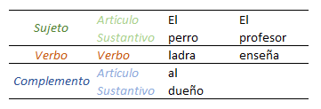
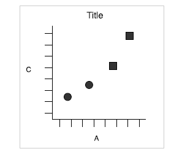

```{r xaringan-themer, include = FALSE}
library(xaringanthemer)
library(DiagrammeR)
library(tidyverse)
library(kableExtra)
options(htmltools.dir.version = FALSE)
style_mono_accent_inverse(
  base_color = "#e1af19",
  link_color = "#b1d5d8",
  header_font_google = google_font("Oswald", "500"),
  text_font_google   = google_font("Roboto Slab", "400", "400i"),
  code_font_google   = google_font("IBM Plex Mono")
)
```
# Webinar

- `r icon::fa("r-project")` y RStudio  
     
     
--

- La **gramática de gráficos** y ggplot2        
      

--

- **Ploteo** con ggplot2:

  * Data
  * Aes
  * Geoms
  * Themes
     
---
# ¿Por qué dataViz en `r icon::fa("r-project")`?

- [Drivers de éxito profesional por clase](https://twitter.com/torres__an/status/1229691472498319360/photo/1)

- [Tour de Francia I](https://twitter.com/geokaramanis/status/1247586395876741120/photo/1)

- [Tour de Francia II](https://twitter.com/ariamsita/status/1248907681903099904/photo/1)

- [Crisis política e institucional en España](https://twitter.com/pablocalv/status/1189608772538372096/photo/1)

---

# `r icon::fa("r-project")` como lenguaje orientado a objetos

- `r icon::fa("r-project")` es un lenguaje de programación estadístico orientado a objetos:

--

```{r object oriented}
a <- c(5, 6)
b <- 2
```

--

- Los objetos son almacenados y pueden ser utilizados en otras operaciones:
```{r}
a*b
```

---
# Funciones y paquetes en `r icon::fa("r-project")`

- Las **funciones** son las herramientas que nos permiten interaccionar con los objetos (datos)

--

- Las **funciones** contienen argumentos:
```{r, echo=TRUE}
a <- c(3, 5, 9)
mean(a)
```

--

- Las **funciones** se organizan en **paquetes**. Existen más de 15,500 paquetes: manipulación de datos, visualización, análisis estadísticos, especializados por área.

--

- `r icon::fa("r-project")` tiene preinstaldos siete paquetes, el resto hay que instalarlos según se necesiten:
```{r, eval=FALSE}
install.packages("ggplot2") # instala el paquete ggplot2
library(ggplot2) # carga el paquete ggplot2
```

---
# `r emo::ji("sos")` Help!

#### `help()`

 - **Ayuda** con las funciones:  
```{r documentation, echo=T, eval=FALSE}
help(mean)
?mean
```    

--

- **Vignettes** y ejemplos     

- [Stackoverflow](https://stackoverflow.com/)    

- [Cheatsheets](https://www.rstudio.com/resources/cheatsheets/)    

- [Quick `r icon::fa("r-project")`](https://www.statmethods.net/)


---
# Workflow en RStudio

.center[]

---
# Paquetes, datos y funciones

- **ggplot2** y **ggthemes**

- **mpg** es un *data frame*: datos rectangulares en los que cada fila es un caso y cada columna una variable

- Funciones para explorar los datos:

```{r, eval=FALSE}
str(object = mpg) # estructura del data frame (df)
summary(object = mpg) # estadísticos descriptivos de las variables del df
head(x = mpg) # muestra primeras 6 observaciones del df
```

```{r, eval=FALSE}
str(mpg) # también funciona
summary(mpg) 
head(mpg) 
```


### `r emo::ji("brain")` Try It 1

---
# Gramática de graficos

--

.pull-left[
- La gramática permite organizar los elementos básicos para que cobren sentido

- Descompone estructuras complejas en unidades básicas:

.center[

]

]

--

.pull-right[

.center[]

]

---

## ggplot2 y la gramática de gráficos


.center[]


---

# Estructura ggplot2

- **ggplot2** se estructura basado en la gramática de gráficos a través de capas, cada
capa (+) añade un elemento nuevo  
   
- Estructura básica (data, aes y geom_): 

```{r fig.width=5, fig.height=3.8, fig.align='center', echo=T, warning=FALSE, eval=FALSE}
# guardado como objeto my_plot
my_plot <- ggplot(data = mpg, mapping = aes(y = cty, x = class)) + 
                  geom_boxplot()
my_plot

# no guardado
ggplot(data = mpg, mapping = aes(y = cty, x = class)) + 
                  geom_boxplot()
```
---

# Aesthetics 
   
Aspectos que pueden ser utilizados para representar información (cambia según la geometría): 
   
- Eje x (x)
- Eje y (y)
- Color (color)
- Forma (shape)
- Tamaño (size)
- Transparencia (alpha)
- Relleno (fill)
- Tipo de línea (linetype)

---
# Aesthetics 

```{r fig.width=8, fig.height=3.8, fig.align='center', echo=T, warning=FALSE}
ggplot(data = mpg, mapping = aes(y = cty, x =  class)) + 
  geom_boxplot()

```

---

## Aesthetics 


- Diferenciar entre aesthetics y atributos

--

- Aesthetics se puede incorporar tanto dentro de `ggplot()` como del `geom`
   

```{r fig.width=2.25, fig.height=2.25, echo=T, warning=FALSE, eval=FALSE}
# Opción 1

ggplot(data = mpg, mapping = aes(y = cty, x = class)) + 
  geom_boxplot()

# Opción 2

ggplot(data = mpg) + 
  geom_boxplot(mapping = aes(y = cty, x = class))

```

---
.pull-left[
### Aesthetics
```{r plot1, echo=T, warning=FALSE, fig.width=7, fig.height=4.5, fig.align='center'}
ggplot(data = mpg, 
      mapping = aes(y = cty, x = class, color = class)) + 
  geom_boxplot()

```
]

.pull-right[
## Atributos
```{r plot2,  echo=T, warning=FALSE, fig.width=7, fig.height=4.5, fig.align='center'}
ggplot(data = mpg, mapping = aes(y = cty, x = class)) + 
{{  geom_boxplot(color = "red", size = 2) }}

```
]

---
# Ejemplo efecto herencia

Añadir un gráfico de dispersión (scatter) que muestre la dispersión de los datos: 

```{r fig.width=7, fig.height=3.8, fig.align='center', echo=T, warning=FALSE}
ggplot(data = mpg, mapping = aes(y = cty, x =  class)) + 
  geom_boxplot() +
  {{ geom_point() }}

```


---

.pull-left[
### geom_density2d
```{r echo=T, warning=FALSE, fig.width=7, fig.height=4.5, fig.align='center'}
base_plot <- ggplot(data = mpg, mapping = aes(x = cty, y = hwy))
base_plot + geom_density_2d()

```
] 

.pull-right[
### geom_rug
```{r echo=T, warning=FALSE, fig.width=7, fig.height=4.5, fig.align='center'}
base_plot + geom_rug()

```
] 

---

.pull-left[
### geom_col
```{r echo=T, warning=FALSE, fig.width=7, fig.height=4.5, fig.align='center'}
base_plot <- ggplot(data = mpg, mapping = aes(x = class, y = hwy))
base_plot + geom_col()

```
] 

.pull-right[
### geom_violin
```{r echo=T, warning=FALSE, fig.width=7, fig.height=4.5, fig.align='center'}
base_plot + geom_violin()

```
]

---
.pull-left[
### geom_histogram
```{r echo=T, warning=FALSE, fig.width=7, fig.height=4.5, fig.align='center', message=FALSE}
base_plot <- ggplot(data = mpg, mapping = aes(x = hwy))
base_plot + geom_histogram()

```
] 


.pull-right[
### geom_dotplot
```{r echo=T, warning=FALSE, fig.width=7, fig.height=4.5, fig.align='center', message=FALSE}
base_plot + geom_dotplot()

```
] 

---
# Labels 


```{r echo=T, warning=FALSE, fig.width=7, fig.height=4.5, fig.align='center', message=FALSE}
ggplot(data = mpg, mapping = aes(x = class, y = hwy, color = class)) +
  geom_violin() +
  labs(tile = "Mi título",
       subtile = "Subtítulo",
       x = "Tipo de vehículo",
       y = "Millas por galón (autopista)")

```

---
# Theme

```{r echo=T, warning=FALSE, fig.width=7, fig.height=4.5, fig.align='center', message=FALSE}
ggplot(data = mpg, mapping = aes(x = class, y = hwy, color = class)) +
  geom_violin() +
  theme_minimal()

```


